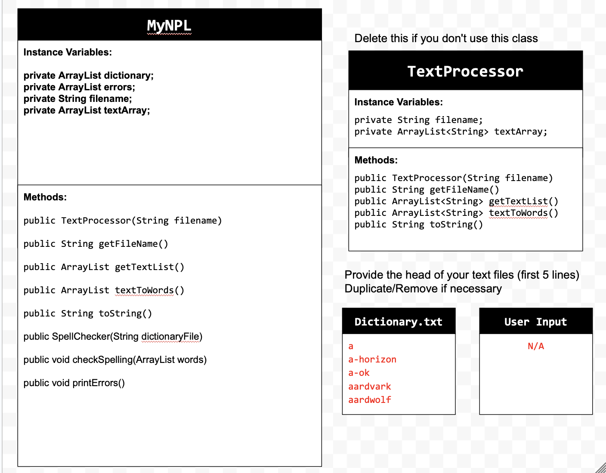

# Unit 6 - Natural Language Processing Project

## Introduction

Natural language processing (NLP) is used in many apps and devices to interact with users and make meaning of text to determine how to respond, find information, or to create new text. Your goal is to use natural language processing techniques to identify structure, patterns, and meaning in a text to have conversations with a user, execute commands, perform manipulations on the text, or generate new text.

## Requirements

Use your knowledge of object-oriented programming, ArrayLists, the String class, and algorithms to create a program that uses natural language processing techniques:

- **Create at least two ArrayLists** – Create at least two ArrayLists to store the data used in your program, such as data from text files or entered by the user.
- **Implement one or more algorithms** – Implement one or more algorithms that use loops and conditionals to find or manipulate elements in an ArrayList or String object.
- **Use methods in the String classs** - Use one or more methods in the String class in your program, such as to divide text into sentences or phrases.
- **Use at least one natural language processing technique** – Use a natural language processing technique to process, analyze, and/or generate text.
- **Document your code** – Use comments to explain the purpose of the methods and code segments and note any preconditions and postconditions.

## UML Diagram

Put and image of your UML Diagram here. Upload the image of your UML Diagram to your repository, then use the Markdown syntax to insert your image here. Make sure your image file name is one word, otherwise it might not properly get display on this README.

## Video

Record a short video of your project to display here on your README. You can do this by:

- Screen record your project running on Code.org.
- Upload that recording to YouTube.
- Take a thumbnail for your image.
- Upload the thumbnail image to your repo.
- Use the following markdown code:

## Project Description

The goal of our Spell Checker is to gather text inputted by a user and check the spelling of each individual word. How it works is it compares each word that is inputted from a user, with a predefined dictionary we inputted in a txt file. If it not found to be in the dictionary it will be printed out as a misspelled word. 

## NLP Techniques

Some NLP techniques that we used in our project includes text break down  and text conversion. As our program analyzes text it breaks down the text to identify what a word is with the different characters. It breaks down words using the .split method looking for a space so at every space that is the end of the word. This is implented in the prompt method as it takes the user input. We also use text conversion as our predefined dictionary is in only lowercase letters we have to make all the text that the user inputted lowercase as it can have upper case letters. We use .toLowerCase in the prompt method as well when it takes the users input. NExt is 